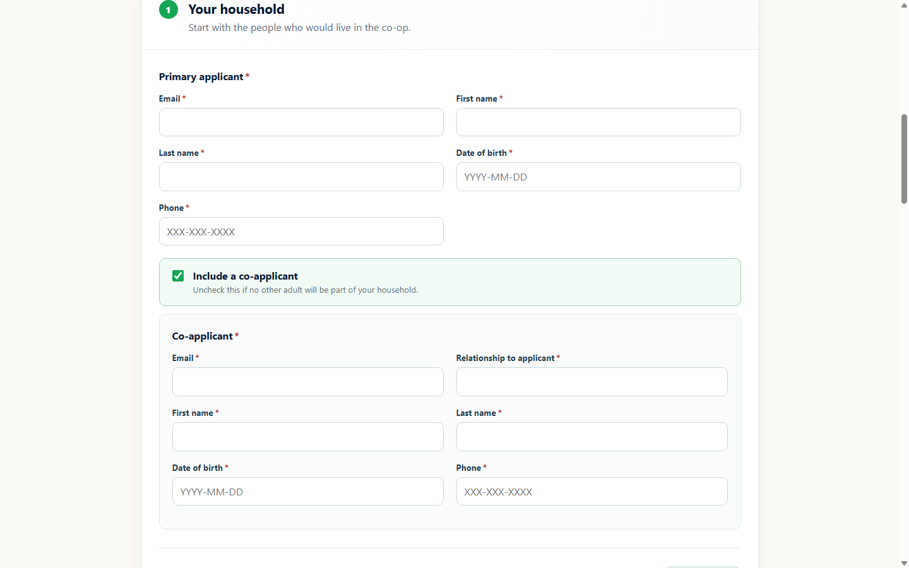
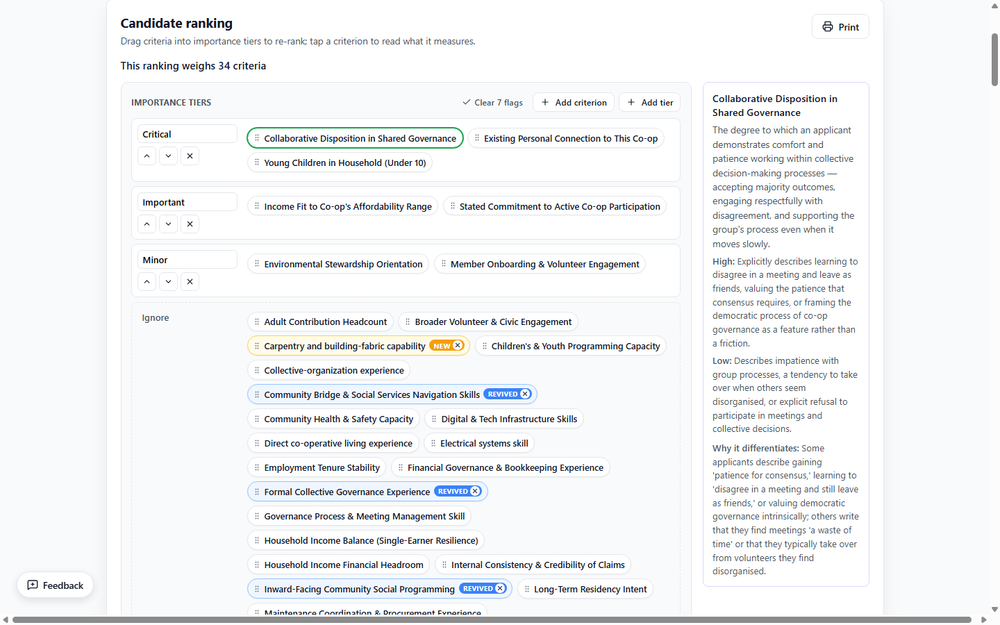
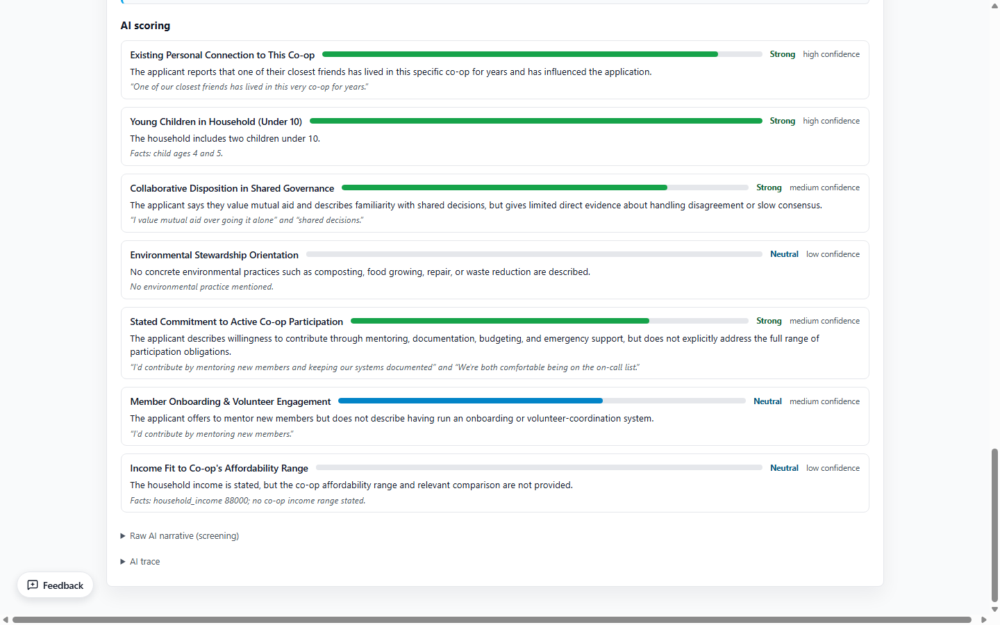
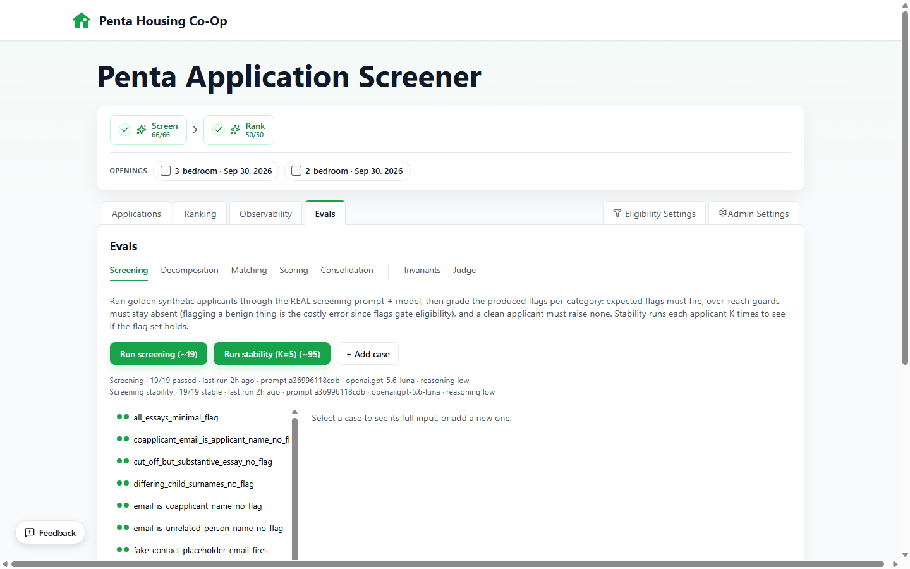

# Penta Housing Application System

Penta's production system for the complete housing-application lifecycle: public intake, private
working copies, secure applicant access, opening participation, committee review, AI-assisted
screening and ranking, applicant outcomes, transactional email, and retention. The Penta Housing
Co-op membership committee uses `screener.pentacoop.com`; applicants use
`applications.pentacoop.com`.

Applicants can begin without an account, save privately through an emailed access link, submit to
one or more current openings, and return later to update or reuse their application. The committee
manages openings and outcomes in the same database, while the screening workflow applies
deterministic eligibility filters, runs cached AI passes over the submitted pool, and produces a
committee-weighted shortlist with every AI-influenced number traceable to its evidence.

It is both a live operational application and a portfolio project exploring the craft of AI product
design: human-in-the-loop review, cost-aware model use, and the judgment of which decisions to keep
deterministic and which to hand to an LLM.

## Production Proof

This is a live production system, not a demo. Penta's membership committee uses it to review real
applications and make real housing decisions. Its 2026 cutover retained 232 submitted applications,
migrated and reconciled 1,478 vacancy-notification subscriptions, and moved applicant intake,
committee review, transactional email, and retention into one operating system.

Screenshots use the committed synthetic fixture; no real applicant data is published.



*The applicant experience begins with structured household details and continues through housing,
essays, employment, income, review, and submission.*

## Design Highlights

A few decisions I'm particularly happy with — the ideas that make this more than a wrapper around an LLM call:

- **AI suggestions are inert until a human activates them.** The model may propose *any* differentiating dimension, but a discovered one carries **weight 0 until a committee member drags it into a tier** — nothing the AI says can move a ranking on its own. Safety becomes a property of the workflow rather than of prompt wording, so *every* junk suggestion is harmless by default, including the ones I never anticipated.

- **The LLM extracts features; the math does the ranking.** No model is ever asked "who's the best candidate?" — it scores each applicant per dimension (with rationale and evidence), and fit is a pure, inspectable formula, `Σ(weight·score) / Σ(weight)`, so every ranked number traces back to a specific score and a committee-assigned weight.

- **Content-addressed caching, so nothing is ever paid for twice.** Every result is cached on a key of *(application content, pass, model, prompt version)*, so an unchanged applicant reuses its stored score for free — a cache hit is exempt from the spending cap because it makes no model call. On a ~300-applicant pool this is the difference between re-scoring everyone on every tweak and paying only for what genuinely changed. Two things make the key precise: a pass hashes its *own* static prompt text into that `prompt_version`, so editing one prompt re-runs only that pass; and a re-rank runs an LLM identity-match that re-adopts a re-discovered dimension's prior key, so its cached scores carry forward and only genuinely new or edited dimensions are charged. Re-tiering re-sorts with zero spend.

- **Cost estimated up front, capped, and attributed.** Every run projects its cost before starting (over the *uncached* work only), is checked against a server-side spending cap, and refuses no-op re-runs — AI spend is a first-class product surface, not a surprise on a bill.

- **Every pass persists its reasoning, and the reasoning is a product surface, not a log file.** Each AI call's free-text rationale and structured audit trail (what discovery found, how decomposition settled it, why consolidation merged a pair) are stored per run and rendered in the Observability tab. That trace pays for itself three ways: it turns a red ✗ into a root cause when a pass misbehaves (one pet-flag miss became a three-line prompt fix *because* the captured reasoning explained why the model held back); it's the audit trail that lets a committee trust an AI-influenced ranking; and it's mined to grow the eval sets — real runs become labelled test cases instead of hand-fabricated ones.

## What It Does

The product has two browser-facing services backed by one application, database, session model,
email boundary, and applicant record.

### Applications Service

- Public applicant form with guest entry, private saved working copies, deliberate submission,
  opening selection, emailed access links, and immutable submitted versions.
- One application can participate in later or simultaneous openings without duplicating the
  applicant's answers.
- Applicant-controlled email changes and deletion, collision-safe identity handling, revocable
  sessions, and credential-safe transactional-email retries.
- Date-driven opening phases, administrator-confirmed selections, unsuccessful-applicant notices,
  and automatic retention: one year for unsuccessful or withdrawn applicants and seven years for
  selected members.
- One-notice vacancy subscriptions with preference replacement, opening-audience previews,
  retry-safe delivery, administrative reporting, and narrow exact-address support controls.

### Screener Service

- Submitted applications appear automatically. Only participation in current, non-archived
  openings enters committee and AI scope.
- Committee sign-in by Google or emailed magic link, both issuing the same revocable server-side
  session. Google login is identity-only; access and roles come from the application allowlist.
- Deterministic hard filters for clear eligibility issues, computed from the latest submitted fields.
- Application dashboard, searchable/sortable table, facets, pagination, and candidate detail pages.
- The committee workflow is **Screen → Rank**; each paid step is gated behind a confirmation card
  with an up-front cost estimate.
- **Screen:** AI integrity pass flagging suspicious, AI-boilerplate, or low-quality submissions and
  routing them into an explicit AI Flagged review bucket; a human can accept or override the result.
- **Rank:** one orchestrated AI chain over eligible applicants — parallel pattern discovery → decomposition into one non-overlapping set → identity-match onto prior runs → per-dimension scoring → post-score duplicate consolidation — feeding a weighted ranked list with relative fit bands and per-driver rationale. (Detailed in *The AI Pipeline* below; the ranking math is in *The LLM extracts features; the math does the ranking* above.)
- **Interactive tier-list weighting:** drag discovered criteria into Critical/Important/Minor/Ignore tiers to instantly re-sort. Re-ranking carries tier placements forward and reuses cached scores (see the caching design above).
- **Reports:** browser print-to-PDF of the ranked view and candidate detail pages, with an `@media print` stylesheet and a text importance-tiers summary.
- Provider-agnostic AI interface with Strands routes for Bedrock, OpenAI, and Anthropic, plus a deterministic mock provider for tests.
- Human status overrides with stale-finding indicators when machine findings change later.
- Admin-managed eligibility rules, pet limits, AI models, concurrency, spending cap, access, and
  operational settings.

## The AI Pipeline

Every AI call is a **named, single-purpose pass** — never a general "agent" deciding what to do next. The orchestration is deterministic code and human-gated workflow steps; no model chooses which pass runs, and no pass calls another. Each is a structured-output call with its own prompt, schema, cache/version, cost line, and reasoning trace. Model tier is chosen per job: cheap-and-fast **Haiku** where call *count* drives cost, stronger **Sonnet** for the once-per-run judgment calls.

**Screen** (one pass, runs on its own):
- **Screening integrity flags** *(Haiku)* — reads each application and flags placeholder/suspicious names, spam or AI-boilerplate essays, internal inconsistencies, and contact/pet-policy issues. A flag moves the application into the AI Flagged review bucket; human status decisions remain authoritative.

**Rank** (one button, five passes chained deterministically over the eligible pool):
1. **Pattern discovery** *(Sonnet, ×K in parallel)* — reads the whole pool and discovers the dimensions it actually varies on. Runs K times on fresh contexts; their cross-call disagreement is the diversity the next step needs. Each call is blind except for committee proposals seeded into one worker.
2. **Decomposition** *(Sonnet)* — settles the K overlapping discovery reports into one finest, non-overlapping set: collapses re-carvings of one concept, keeps genuinely distinct axes apart, protects committee-requested axes.
3. **Identity matching** *(Sonnet)* — maps this run's dimensions onto prior runs' by *meaning*, so a re-discovered concept re-adopts its old key and carries its tier placement + cached scores forward. A high bar (a wrong match corrupts a reused score), so it errs toward "new."
4. **Dimension scoring** *(Haiku, per candidate)* — scores each applicant on each dimension from −1 (low end) to +1 (high end), 0 neutral, with a rationale and grounding evidence. Silence scores 0, never negative — absence of evidence isn't a weakness. The only per-applicant pass; everything above is pool-level.
5. **Consolidation** *(Sonnet)* — post-score cleanup: since every dimension now has a per-applicant score vector, near-identical vectors *nominate* suspected duplicates the definition-only match pass missed, and one confirm call merges genuine ones (aliasing the newer key to the older, so the key space converges instead of growing). Distinct axes that merely correlate are kept apart.

Then the ranking itself is **pure deterministic math** over the cached scores and committee tier weights — no model call. Two invariants hold across all of it: **AI output is inert until a human activates it** (a discovered dimension has weight 0 until tiered), and **every pass persists its reasoning + cost** so any number traces back to its evidence.



*AI-discovered criteria begin inert; committee members decide what matters by placing them into importance tiers.*



*Every candidate score stays inspectable through its rationale, source evidence, confidence, and qualitative band.*

The spec lives in [SPEC.md](SPEC.md); developer architecture notes in
[docs/app-architecture.md](docs/app-architecture.md), with deeper references in
[docs/ai-screening.md](docs/ai-screening.md) and [docs/api.md](docs/api.md). The canonical built-in
application contract is `backend/app/schemas/applicant/answers.py`. Significant design decisions
live in [docs/adr/](docs/adr/). Shared agent guidance lives in [.clinerules](.clinerules), with
[AGENTS.md](AGENTS.md) pointing agents there.

## Observability And Evals

The application treats AI inspectability and model-quality work as product capabilities, not
offline log archaeology.

### Observability

- Every model call records its pass, model and provider route, prompt version, reasoning summary,
  structured output, token usage, cost, duration, and failure state.
- Run audits show what each discoverer proposed, how decomposition settled overlapping ideas,
  which prior dimensions identity matching carried forward, and why consolidation merged or kept
  nominated duplicates.
- Candidate details keep source answers beside AI findings and score evidence. Cost and operational
  trend views attribute work to the member who triggered it.
- Cached results remain auditable even when no new provider call or charge is required.

### Evals

- Deterministic software tests cover schemas, orchestration, caching, ranking math, status changes,
  and safety boundaries.
- Property evals check invariants that must hold for every Rank, while labelled per-pass golden cases
  exercise screening, decomposition, matching, scoring, and consolidation against live models.
- Stability runs repeat non-deterministic cases to expose flips instead of hiding them behind one
  passing sample.
- A blind LLM judge audits human labels and reports agreement, Cohen's kappa, and problem-detection
  recall/precision. Judge results are review signals, never CI gates or production mutations.
- Applicant-facing eval cases can be harvested only from pools carrying persisted synthetic
  provenance, keeping real application text out of source control.

**A regression the evals caught:** I changed the screening prompt so one blank optional essay could
not flag an otherwise substantive application. The new cases passed, but an existing golden exposed
collateral damage: an unrelated parent-count inconsistency fell to 40% reliability. A targeted
correction restored it to 100%, while both new essay boundaries also held at 100%. That is exactly
the kind of semantic regression ordinary unit tests cannot catch.



*The in-app Evals cockpit runs labelled golden cases and repeated stability checks against live models.*

The in-app **Observability** and **Evals** tabs expose these workflows. Paid evals run only after
explicit confirmation and never during Rank or the normal test suite. The full design, case schema,
stability harness, and judge methodology are documented in
[docs/ai-evals.md](docs/ai-evals.md).

## Privacy And Test Data

Applicant data is sensitive. Do not commit real application exports, local SQLite databases, OAuth credentials, raw AI traces, exported/printed reports with applicant data, or `.env` files.

The sample CSV in [test-data](test-data) is synthetic and intentionally realistic so intake, screening, and AI quality checks can be exercised locally. See [test-data/README.md](test-data/README.md) for the loader and directory policy.

## Tech Stack

- Backend: Python, FastAPI, SQLAlchemy, Alembic, SQLite
- Python tooling: `uv`, project-local virtual environment, `pytest`
- Frontend: Vite, React, TypeScript, npm
- Authentication: identity-only Google OIDC or email magic links with revocable server-side sessions
- Transactional email: provider-neutral sender with SocketLabs delivery, a durable retry-safe
  outbox, admin delivery reporting, and capture-only local defaults
- Google integration: optional identity-only OIDC for applicant and committee sign-in
- AI integration: provider-agnostic interface; Strands routes through Bedrock or direct OpenAI/Anthropic APIs; mock provider for tests
- Hosting: Fly.io (single instance, auto-suspend, persistent-volume SQLite) serving the committee
  and applicant hostnames; FastAPI serves the built SPA; deployed manually with
  `fly deploy --remote-only`

## Setup

1. Install prerequisites:

   - [uv](https://docs.astral.sh/uv/)
   - Node.js 20+ with npm
   - PowerShell 7 on Windows if using `dev.ps1`

2. Initialize dependencies and the local database:

   ```sh
   bash ./setup.sh       # macOS/Linux
   ```

   ```powershell
   ./setup.ps1           # Windows PowerShell
   ```

3. Configure Google OAuth.

   Place the downloaded OAuth client JSON from Google Cloud Console in `backend/secrets/`:

   ```sh
   mkdir -p backend/secrets
   # copy or move the downloaded client_secret_*.json file into backend/secrets/
   ```

   The backend auto-discovers any `client_secret_*.json` file in that directory. The directory is ignored by Git.

   See [docs/google-cloud-oauth-setup.md](docs/google-cloud-oauth-setup.md) for full Google Cloud and OAuth details.

   The setup script has already run the database migrations.

## Local Development

Start both servers:

```sh
./dev.sh        # macOS/Linux
```

```powershell
./dev.ps1       # Windows PowerShell
```

The backend runs at `http://localhost:8000`. The frontend runs at `http://localhost:5173`.
Open `http://localhost:5173/?applicant` to exercise the applicant form.
Open `http://localhost:5173/?preview=access` to review every access screen and transactional
email with synthetic data. The preview is available only in local development and never sends email.
Save and return later accepts an incomplete application, stores a private pending draft, and sends
a 24-hour access link. Submitting still requires a deliberate action and at least one selectable
opening.

To seed a wholly synthetic local database from the committed fixture, publish an opening,
set `APPLICATION_DATA_IS_SYNTHETIC=true`, then run from `backend/`:

```sh
uv run python -m scripts.load_synthetic_applications --opening-id 1 --opening-id 2
```

Repeat `--opening-id` to attach every fixture applicant to each desired local opening. The loader
is idempotent, sends no email, refuses non-SQLite databases, and will not overwrite an application
unless it is already stamped synthetic.

To populate the vacancy-notification report and exact-email support controls without touching
production or sending email, seed four fixed `@jeffo.net` demo records:

```sh
cd backend
uv run python -m scripts.seed_demo_vacancy_subscriptions
```

The command is repeatable, requires the same synthetic SQLite guard as the application fixture, and
refuses to replace a same-address subscription that it did not create.

On Windows, `dev.ps1` writes per-service output and errors to `.dev-logs/`. If either
service exits, it prints the last log lines; it also retries the frontend twice before
leaving the backend running for diagnosis. It uses `watchfiles` to replace the backend process
reliably after Python edits. Vite HMR updates ordinary frontend edits and also tells the open email
gallery to refetch when its Python templates change.

If local screening data looks stale or inconsistent, reset the local SQLite database before starting dev:

```sh
./reset-db.sh
./dev.sh
```

```powershell
./reset-db.ps1
./dev.ps1
```

### Backups

A Rank's output is expensive (paid Bedrock calls) and non-deterministic — it cannot be
regenerated identically — so the local database is snapshotted. Snapshots use SQLite
`VACUUM INTO` (a consistent hot copy, safe while the backend is running) and land in
`backend/data/backups/`, which is gitignored (the snapshots hold applicant PII and must
never be committed).

- **Automatic:** every completed Rank snapshots the DB (best-effort — a backup failure
  never fails the run).
- **Manual:** `./backup-db.sh [tag]` (`./backup-db.ps1 -Tag <label>` on Windows) — e.g.
  before anything risky. The newest ~50 snapshots are kept.
- **Restore:** `./restore-db.sh` lists snapshots and prompts for one (`--latest` for the
  most recent); `./restore-db.ps1` on Windows. The current DB is snapshotted first (tag
  `pre-restore`), so a restore is itself reversible. The restore also reapplies the current
  hard-purge ledger so an older local snapshot cannot resurrect an aggregate already removed by
  retention. Stop the backend before restoring.

Or run services individually:

Backend:

```sh
cd backend
uv run fastapi dev app/main.py
```

Frontend:

```sh
cd frontend
npm run dev
```

## Tests

Backend:

```sh
cd backend
uv run pytest
```

Frontend build/type check:

```sh
cd frontend
npm run build
```

## License

This project is licensed under the **Apache License 2.0**. See [LICENSE](LICENSE).
